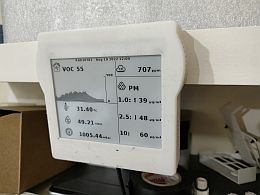
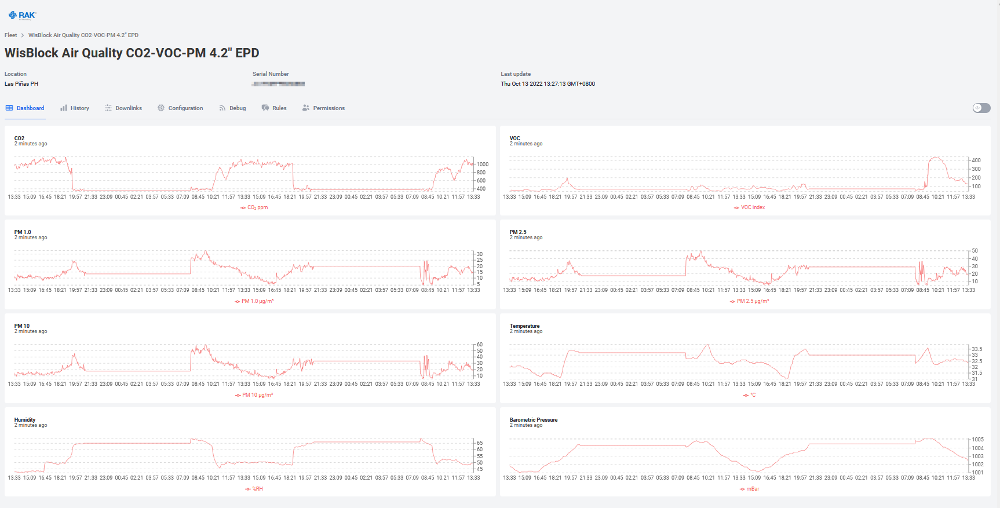

# WisBlock Indoor Air Quality Sensor
|  |  |  |    
| --- | --- | --- |     

This tutorial shows how to build a indoor air quality sensor with the WisBlock eco system.    
With the release of the new RAK12037 CO2 and RAK12039 Particle Matter sensor the most important air quality indizes can now be measured.    
The final device in this tutorial is measuring CO2, Particle Matter, VOC, temperature, humidity and barometric pressure. It can be comined with the RAK14000 to display the different values. But more important, it sends the measured values over LoRaWAN for further processing and taking actions.    

### _REMARK 1_     
This firmware is using the [WisBlock API](https://github.com/beegee-tokyo/WisBlock-API) ⤴️ which helps to create low power consumption application and taking the load to handle communications from your shoulder.    

### _REMARK 2_
For the displays, the RAK14000 EPD module with the 2.13" display can be used. But for better visualization this code supports as well a 3.52" and a 4.2" display. The 4.2" display might be added as a variant to the WisBlock RAK14000 in the future.

----

# Content
- [Hardware supported](#hardware_supported)
- [Software used](#software_used)
- [How to use it](#how_to_use_it)
- [Packet data format](#packet_data_format)
- [Compiler Flags](#compiler-flags)
   - [Versioning](#versioning)
   - [Debug options](#debug-options)
   - [Base Board selection](#base-board-selection)
   - [Bluetooth selection](#bluetooth-selection)
   - [Display options](#display-options)
   - [Usage of Bosch BSEC library](#usage-of-bosch-bsec-library)
- [Example for a visualization and alert message](#example-for-a-visualization-and-alert-message)

<center></center>

----

# Hardware supported
| Module | Function |
| --     | --       |
| [RAK4631](https://docs.rakwireless.com/Product-Categories/WisBlock/RAK4631/Overview/) ⤴️ | WisBlock Core module |
| [RAK19001](https://docs.rakwireless.com/Product-Categories/WisBlock/RAK19001/Overview/) ⤴️ | WisBlock Fullsize Base board |
| [RAK1901](https://docs.rakwireless.com/Product-Categories/WisBlock/RAK1901/Overview/) ⤴️ | WisBlock Temperature and Humidty Sensor |
| [RAK1902](https://docs.rakwireless.com/Product-Categories/WisBlock/RAK1902/Overview/) ⤴️ | WisBlock Barometer Pressure Sensor |
| [RAK1906](https://docs.rakwireless.com/Product-Categories/WisBlock/RAK1906/Overview/) ⤴️ | WisBlock Environment Sensor |
| [RAK12002](https://docs.rakwireless.com/Product-Categories/WisBlock/RAK12002/Overview/) ⤴️ | WisBlock RTC module |
| [RAK12010](https://docs.rakwireless.com/Product-Categories/WisBlock/RAK12010/Overview/) ⤴️ | WisBlock Ambient Light sensor |
| [RAK12019](https://docs.rakwireless.com/Product-Categories/WisBlock/RAK12019/Overview/) ⤴️ | WisBlock UV Light sensor |
| [RAK12037](https://docs.rakwireless.com/Product-Categories/WisBlock/RAK12037/Overview/) ⤴️ | WisBlock CO2 sensor |
| [RAK12039](https://docs.rakwireless.com/Product-Categories/WisBlock/RAK12039/Overview/) ⤴️ | WisBlock Particle Matter sensor |
| [RAK12047](https://docs.rakwireless.com/Product-Categories/WisBlock/RAK12047/Overview/) ⤴️ | WisBlock VOC sensor |
| [RAK14000](https://docs.rakwireless.com/Product-Categories/WisBlock/RAK14000/Overview/) ⤴️ | WisBlock EPD |

----

# Software used
## IDE
- [PlatformIO](https://platformio.org/install) ⤴️
- alternative [ArduinoIDE](https://www.arduino.cc/en/software) ⤴️
- [Adafruit nRF52 BSP](https://docs.platformio.org/en/latest/boards/nordicnrf52/adafruit_feather_nrf52832.html) ⤴️
- [Patch to use RAK4631 with PlatformIO](https://github.com/RAKWireless/WisBlock/tree/master/PlatformIO) ⤴️
## LoRaWAN and BLE communication
- [WisBlock-API](https://registry.platformio.org/libraries/beegee-tokyo/WisBlock-API) ⤴️
- [SX126x-Arduino LoRaWAN library](https://registry.platformio.org/libraries/beegee-tokyo/SX126x-Arduino) ⤴️
- [CayenneLPP](https://registry.platformio.org/libraries/sabas1080/CayenneLPP) ⤴️
- [ArduinoJson](https://registry.platformio.org/libraries/bblanchon/ArduinoJson) ⤴️
## Sensor libraries
- [Adafruit BME680 Library](https://registry.platformio.org/libraries/adafruit/Adafruit%20BME680%20Library) ⤴️
- [Adafruit LPS2X](https://registry.platformio.org/libraries/adafruit/Adafruit%20LPS2X) ⤴️
- [Adafruit Unified Sensor](https://registry.platformio.org/libraries/adafruit/Adafruit%20Unified%20Sensor) ⤴️
- [ClosedCube OPT3001](https://github.com/beegee-tokyo/ClosedCube_OPT3001_Arduino) ⤴️
- [Melopero RV3028](https://registry.platformio.org/libraries/melopero/Melopero%20RV3028) ⤴️
- [nRF52_OLED](https://registry.platformio.org/libraries/beegee-tokyo/nRF52_OLED) ⤴️
- [RAK12019_LTR390_UV_Light](https://registry.platformio.org/libraries/beegee-tokyo/RAK12019_LTR390_UV_Light) ⤴️
- [RAKwireless VEML Light Sensor](https://registry.platformio.org/libraries/rakwireless/RAKwireless%20VEML%20Light%20Sensor) ⤴️
- [Sensirion Core](https://registry.platformio.org/libraries/sensirion/Sensirion%20Core) ⤴️
- [Sensirion Gas Index Algorithm](https://registry.platformio.org/libraries/sensirion/Sensirion%20Gas%20Index%20Algorithm) ⤴️
- [Sensirion I2C SGP40](https://registry.platformio.org/libraries/sensirion/Sensirion%20I2C%20SGP40) ⤴️
- [SparkFun SHTC3 Humidity and Temperature Sensor Library](https://registry.platformio.org/libraries/sparkfun/SparkFun%20SHTC3%20Humidity%20and%20Temperature%20Sensor%20Library) ⤴️
- [LPS35HW](https://registry.platformio.org/libraries/pilotak/LPS35HW) ⤴️
- [RAK12039 PM Sensor](https://registry.platformio.org/libraries/beegee-tokyo/RAK12039_PM_Sensor) ⤴️
- [SparkFun SCD30 Arduino Library](https://registry.platformio.org/libraries/sparkfun/SparkFun%20SCD30%20Arduino%20Library) ⤴️
- [Adafruit EPD](https://registry.platformio.org/libraries/adafruit/Adafruit%20EPD)
- [Bosch BSEC](https://registry.platformio.org/libraries/boschsensortec/BSEC%20Software%20Library)

### _REMARK_     
The project was developed using Platform IO.    

### _REMARK_
When using PlatformIO, the libraries are all listed in the **`platformio.ini`** and are automatically installed when the project is compiled.

----

# How to use it
Compile the firmware and flash it on a WisBlock with all required modules installed.

## Setup the LPWAN credentials with one of the options:

### Over USB

Connect over USB to setup the LPWAN credentials. Use the DevEUI printed on the RAK4631, use the AppEUI and AppKey from your LPWAN server. Do NOT activate automatic join yet. As weather sensor levels are not changing very fast, it might be sufficient to set the send frequency to every 10 minutes. The send frequency is set in seconds, so the value would be  10 * 60 ==> 600

**Example AT commands:**
```AT
AT+NWM=1
AT+NJM=1
AT+BAND=10
AT+DEVEUI=1000000000000001
AT+APPEUI=AB00AB00AB00AB00
AT+APPKEY=AB00AB00AB00AB00AB00AB00AB00AB00
AT+SENDFREQ=600
```

| Command | Explanation | 
| --- | --- | 
| AT+NWM=1                                   | set the node into LoRaWAN mode |
| AT+NJM=1                                   | set network join method to OTAA |
| AT+BAND=10                                 | set LPWAN region (here AS923-3) see [AT Command Manual](https://github.com/beegee-tokyo/WisBlock-API/blob/main/AT-Commands.md#atband) ⤴️ for all regions |
| AT+DEVEUI=1000000000000001                 | set the device EUI, best to use the DevEUI that is printed on the label of your WisBlock Core module |
| AT+APPEUI=AB00AB00AB00AB00                 | set the application EUI, required on the LoRaWAN server |
| AT+APPKEY=AB00AB00AB00AB00AB00AB00AB00AB00 | set the application Key, used to encrypt the data packet during network join |
| AT+SENDFREQ=600                            | set the frequency the sensor node will send data packets. 600 == 10 x 60 seconds == 10minutes |

### _REMARK_
The manual for all AT commands can be found here: [AT-Commands.md](https://github.com/beegee-tokyo/WisBlock-API/blob/main/AT-Commands.md) ⤴️

### Over BLE
Use the [WisBlock Toolbox](https://play.google.com/store/apps/details?id=tk.giesecke.wisblock_toolbox) ⤴️, connect over Bluetooth with the Soil Sensor and setup the credentials. Do NOT activate automatic join yet.

----

# Packet data format
The packet data is made compatible with the extended Cayenne LPP encoding from [ElectronicCats/CayenneLPP](https://github.com/ElectronicCats/CayenneLPP) ⤴️.    
The content of the packet depends on the modules installed on the WisBlock Base Board:     

| Data                     | Channel # | Channel ID | Length   | Comment                                           | Required Module   | Decoded Field Name |
| --                       | --        | --         | --       | --                                                | --                | --                 |
| Battery value            | 1         | _**116**_  | 2 bytes  | 0.01 V Unsigned MSB                               | RAK4631           | voltage_1          |
| Humidity                 | 2         | 104        | 1 bytes  | in %RH                                            | RAK1901           | humidity_2         |
| Temperature              | 3         | 103        | 2 bytes  | in °C                                             | RAK1901           | temperature_3      | 
| Barometric Pressure      | 4         | 115        | 2 bytes  | in hPa (mBar)                                     | RAK1902           | barometer_4        |
| Illuminance              | 5         | 101        | 2 bytes  | 1 lux unsigned                                    | RAK1903           | illuminance_5      |
| Humidity 2               | 6         | 104        | 1 bytes  | in %RH                                            | RAK1906           | humidity_6         |
| Temperature 2            | 7         | 103        | 2 bytes  | in °C                                             | RAK1906           | temperature_7      | 
| Barometric Pressure 2    | 8         | 115        | 2 bytes  | in hPa (mBar)                                     | RAK1906           | barometer_8        |
| Gas Resistance 2         | 9         | 2          | 2 bytes  | 0.01 signed (kOhm)                                | RAK1906           | analog_9           |
| GNSS stand. resolution   | 10        | 136        | 9 bytes  | 3 byte lon/lat 0.0001 °, 3 bytes alt 0.01 meter   | RAK1910, RAK12500 | gps_10             |
| GNSS enhanced resolution | 10        | _**137**_  | 11 bytes | 4 byte lon/lat 0.000001 °, 3 bytes alt 0.01 meter | RAK1910, RAK12500 | gps_10             |
| Soil Temperature         | 11        | 103        | 2 bytes  | in °C                                             | RAK12023/RAK12035 | temperature_11     |
| Soil Humidity            | 12        | 104        | 1 bytes  | in %RH                                            | RAK12023/RAK12035 | humidity_12        |
| Soil Humidity Raw        | 13        | 2          | 2 bytes  | 0.01 signed                                       | RAK12023/RAK12035 | analog_in_13       |
| Soil Data Valid          | 14        | 102        | 1 bytes  | bool                                              | RAK12023/RAK12035 | presence_14        |
| Illuminance 2            | 15        | 101        | 2 bytes  | 1 lux unsigned                                    | RAK12010          | illuminance_15     |
| VOC                      | 16        | _**138**_  | 2 bytes  | VOC index                                         | RAK12047          | voc_16             |
| MQ2 Gas                  | 17        | 2          | 2 bytes  | 0.01 signed                                       | RAK12004          | analog_in_17       |
| MQ2 Gas Percentage       | 18        | _**120**_  | 1 bytes  | 1-100% unsigned                                   | RAK12004          | percentage_18      |
| MG812 Gas                | 19        | 2          | 2 bytes  | 0.01 signed                                       | RAK12008          | analog_in_19       |
| MG812 Gas Percentage     | 20        | _**120**_  | 1 bytes  | 1-100% unsigned                                   | RAK12008          | percentage_20      |
| MQ3 Alcohol Gas          | 21        | 2          | 2 bytes  | 0.01 signed                                       | RAK12009          | analog_in_21       |
| MQ3 Alcohol Gas Perc.    | 22        | _**120**_  | 1 bytes  | 1-100% unsigned                                   | RAK12009          | percentage_22      |
| ToF distance             | 23        | 2          | 2 bytes  | 0.01 signed                                       | RAK12014          | analog_in_23       |
| ToF Data Valid           | 24        | 102        | 1 bytes  | bool                                              | RAK12014          | presence_24        |
| Gyro triggered           | 25        | _**134**_  | 6 bytes  | 2 bytes per axis, 0.01 °/s                        | RAK12025          | gyrometer_25       |
| Gesture detected         | 26        | 0          | 1 byte   | 1 byte with id of gesture                         | RAK14008          | digital_in_26      |
| LTR390 UVI value         | 27        | 2          | 2 byte   | 0.01 signed                                       | RAK12019          | analog_in_27       | 
| LTR390 UVS value         | 28        | 101        | 2 bytes  | 1 lux unsigned                                    | RAK12019          | illuminance_28     | 
| INA219 Current           | 29        | 2          | 2 byte   | 0.01 signed                                       | RAK16000          | analog_29          | 
| INA219 Voltage           | 30        | 2          | 2 byte   | 0.01 signed                                       | RAK16000          | analog_30          | 
| INA219 Power             | 31        | 2          | 2 byte   | 0.01 signed                                       | RAK16000          | analog_31          | 
| Touchpad left            | 32        | 102        | 1 bytes  | bool                                              | RAK14002          | presence_32        | 
| Touchpad middle          | 33        | 102        | 1 bytes  | bool                                              | RAK14002          | presence_33        | 
| Touchpad right           | 34        | 102        | 1 bytes  | bool                                              | RAK14002          | presence_34        | 
| SCD30 CO2 concentration  | 35        | 125        | 2 bytes  | 1 ppm unsigned                                    | RAK12037          | concentration_35   |
| SCD30 temperature        | 36        | 103        | 2 bytes  | in °C                                             | RAK12037          | temperature_36     |
| SCD30 humidity           | 37        | 104        | 1 bytes  | in %RH                                            | RAK12037          | humidity_37        |
| MLX90632 sensor temp     | 38        | 103        | 2 bytes  | in °C                                             | RAK12003          | temperature_38     |
| MLX90632 object temp     | 39        | 103        | 2 bytes  | in °C                                             | RAK12003          | temperature_39     |
| PM 1.0 value             | 40        | _**138**_  | 2 bytes  | in ug/m3                                          | RAK12003          | voc_40             |
| PM 2.5 value             | 40        | _**138**_  | 2 bytes  | in ug/m3                                          | RAK12003          | voc_41             |
| PM 10 value              | 40        | _**138**_  | 2 bytes  | in ug/m3                                          | RAK12003          | voc_42             |

### _REMARK_
Channel ID's in cursive are extended format and not supported by standard Cayenne LPP data decoders.

Example decoders for TTN, Chirpstack, Helium and Datacake can be found in the folder [decoders](./decoders) ⤴️

### _REMARK_
If using LoRa P2P, the first 8 bytes of the data packet are the devices Dev EUI. This way in LoRa P2P the "gateway" can determine which node sent the packet.

----
# Compiler Flags

The application uses several #define for different application options like the usage of an EPD display or for different Base Boards.    
All defines are in platformio.ini as build flags    

## Versioning

	-DSW_VERSION_1=1     ; major version increase on API change / not backwards compatible
	-DSW_VERSION_2=0     ; minor version increase on API change / backward compatible
	-DSW_VERSION_3=0     ; patch version increase on bugfix, no affect on API

## Debug options

	-DLIB_DEBUG=0        ; 0 Disable LoRaWAN debug output
	-DAPI_DEBUG=0        ; 0 Disable WisBlock API debug output
    -DCFG_DEBUG=1        ; 0 Disable BSP debug output
	-DMY_DEBUG=0         ; 0 Disable application debug output

## Base Board selection
	-DBASE_BOARD=0       ; 1 = RAK19003 0 = other base boards

## Bluetooth selection

	-DNO_BLE_LED=1

## Display options
	-DHAS_EPD=0      ; 1 = RAK14000 4.2" present 2 = 2.13" BW present, 3 = 2.13" BWR present, 4 - 3.52" BW present, 0 = no RAK14000 present
	-DEPD_ROTATION=3 ; 3 = top at cable connection, 1 top opposite of cable connection. Only for 4.2" display

## Usage of Bosch BSEC library

	-D USE_BSEC=1    ; 1 = Use Bosch BSEC algo, 0 = use simple T/H/P readings
	-L".pio/libdeps/rak4631-release/BSEC Software Library/src/cortex-m4/fpv4-sp-d16-hard"

----

# Example for a visualization and alert message

As an simple example to visualize the IAQ data and sending an alert, I created a device in [_**Datacake**_](https://datacake.co).    
Datacake is an easy to use _**Low Code IoT Platform**_. In my Datacake account I setup the device with the matching payload decoder, visualization and creation of an email alert.

## Datacake payload decoder
In the device configuration the Datacake decoder from the [_**decoders**_](./decoders) folder is used.

## Datacake fields
As the SI and PGA values are sent as 10 times of the value, beside of the data fields a formula feed is required to transform the received values to the real values.

| Field Name |  Identifier | Type |
| --- | --- | --- |
| VOC index |  VOC_16 |  Integer |  
| CO2 value |  CONCENTRATION_35 |  Integer |  
| PM 1.0 |  VOC_40 |  Integer |  
| PM 2.5 |  VOC_41 |  Integer |  
| PM 10 |  VOC_42 |  Integer |  
| Humidity |  HUMIDITY_2 |  Float |  
| Temperature |  TEMPERATURE_3 |  Float |  
| Barometric pressure |  BAROMETER_8 |  Float |  
| Battery |  VOLTAGE_1 |  Float |  

## Datacake visualization
In the dashboard you can show the current status and the latest SI and PGA levels.    


